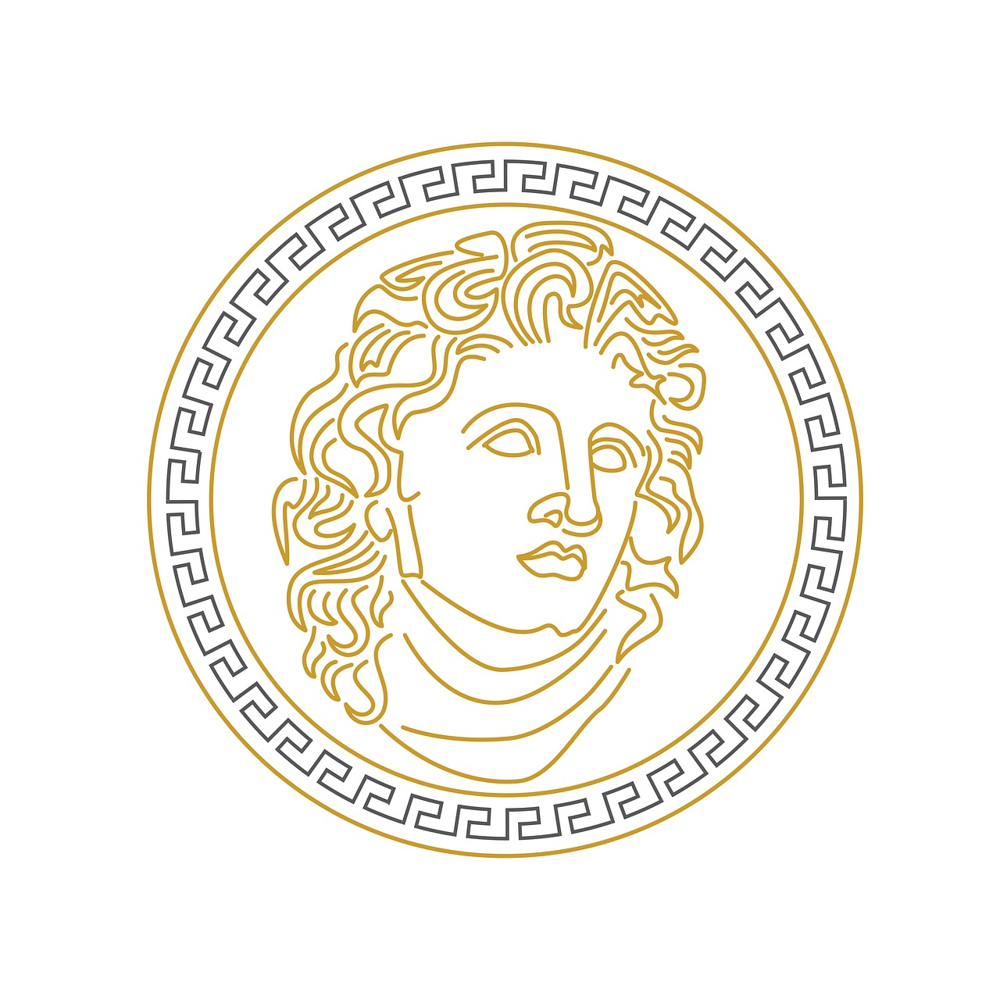

# Apollo

A simple quiz platform, open-source to the world, 
as all things should be. 

### Repository structure

```
project
|-- documentation
|-- services
|   |-- quiz-builder - a go app responsible for defining a quiz
|   |-- quiz-runner - a go app responsible for the execution of an already defined quiz
|   |-- quiz-participant - a go app responsible for handling participant interaction with a quiz
|   |-- common - a go module containing code re-used in the services
|-- ui
    |-- quiz-admin - an admin panel for building and running quizes
    |-- quiz-participant - a participant ui for joining a quiz   
```


